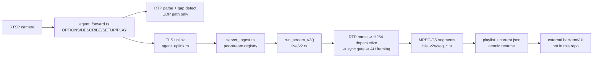

# CCTV Live Playback v2 Review

## Executive Summary

`CCTV live playback v2` has a solid core ingest/HLS artifact path in this repo: RTP parsing is strict, H.264 depacketization covers the common CCTV packetization modes, the v2 pipeline waits for clean SPS/PPS + IDR sync, segments/playlists are written through temp files and renamed atomically, and there is already meaningful unit coverage around sessionization, discontinuities, and publish behavior.

The highest-risk issues are at the session publish and recovery boundaries:

- `current.json` is published before the session is actually playable and never transitions to a distinct `ready` state after the first playlist is published (`sentinel_rtp_cam/src/live/v2.rs:346-380`, `460-718`).
- Old segments are deleted before the replacement playlist is atomically published, which creates a real stale-playlist-to-404 race (`sentinel_rtp_cam/src/live/v2.rs:260-307`).
- The ingest stream registry never recreates a stream pipeline after it exits, so one pipeline error can brick that stream until process restart (`sentinel_rtp_cam/src/bin/server_ingest.rs:343-409`).
- v2 cannot use SDP `sprop-parameter-sets`, so cameras that send SPS/PPS only out-of-band can stay stuck forever even though the agent already parsed the metadata (`sentinel_rtp_cam/src/core/sdp.rs:14-81`, `sentinel_rtp_cam/src/bin/agent_forward.rs:646-657`, `sentinel_rtp_cam/src/live/v2.rs:473-474`).
- Access unit emission is fully marker-bit driven, so cameras with unreliable marker bits can remain permanently unplayable with only a generic watchdog error (`sentinel_rtp_cam/src/live/v2.rs:636-687`).

The task description also references backend lease/signing/asset serving and browser-player recovery behavior. Those modules are not present in this repository. I validated the producer side here and included external-boundary recommendations, but I could not confirm backend/UI implementation details from code because the repo contains no production web client or HLS asset-serving code.

## Review Scope And System Map

### Repositories / modules actually reviewed here

- Agent camera ingest and uplink:
  - `sentinel_rtp_cam/src/bin/agent_forward.rs`
  - `sentinel_rtp_cam/src/agent_uplink.rs`
- RTP/H.264 core:
  - `sentinel_rtp_cam/src/core/rtp.rs`
  - `sentinel_rtp_cam/src/core/h264_depacketize.rs`
  - `sentinel_rtp_cam/src/core/h264_sync.rs`
  - `sentinel_rtp_cam/src/core/sdp.rs`
- Ingest entrypoint and stream registry:
  - `sentinel_rtp_cam/src/bin/server_ingest.rs`
- v2 HLS writer/session logic:
  - `sentinel_rtp_cam/src/live/v2.rs`
- Related tests and coverage tooling:
  - `sentinel_rtp_cam/src/live/v2.rs` tests
  - `scripts/check_live_v2_coverage.sh`

### Not present in this repo

- Backend lease endpoint and `202 waiting_for_idr` implementation
- Signed HLS asset serving and manifest rewrite implementation
- Browser/UI player code (`hls.js`, visibility pause/resume, concurrency cap, stagger start, per-tile retry)

`rg --files` over the repo returned no production `.ts`, `.tsx`, `.js`, or `.jsx` sources, and the only `axum` router present is the local dummy config server in `sentinel_rtp_cam/src/bin/dummy_server.rs`.

### End-to-end flow in this repo

## Confirmed Implementations Mapped To Best Practices

### RTP ingest correctness

- RTP header parsing is strict and sane: version, CSRC, extension, and padding are validated before exposing payload (`sentinel_rtp_cam/src/core/rtp.rs:18-98`).
- Agent UDP ingest explicitly detects sequence gaps and forwards a `GAP` control message upstream instead of continuing silently (`sentinel_rtp_cam/src/bin/agent_forward.rs:734-798`, `sentinel_rtp_cam/src/agent_uplink.rs:465-481`).
- Ingest also does its own sequence continuity check, so loss on the agent-to-ingest path is still caught even if the explicit `GAP` message is missing (`sentinel_rtp_cam/src/live/v2.rs:578-597`).

### H.264 depacketization and sync gating

- Common CCTV packetization modes are implemented: single NAL, STAP-A, and FU-A (`sentinel_rtp_cam/src/core/h264_depacketize.rs:21-114`).
- FU-A reassembly drops incomplete continuation sequences by resetting state on gap/error (`sentinel_rtp_cam/src/core/h264_depacketize.rs:77-113`, `sentinel_rtp_cam/src/live/v2.rs:513-627`).
- The sync gate caches SPS/PPS and will not emit decodable output until it has SPS + PPS + IDR; it prepends SPS/PPS on IDR output (`sentinel_rtp_cam/src/core/h264_sync.rs:30-68`).

### HLS / MPEG-TS artifact publishing

- v2 is additive and isolated from v1 behind `LIVE_PIPELINE_VERSION=v2` (`sentinel_rtp_cam/src/bin/server_ingest.rs:161-193`, `docs/live_pipeline_versions.md:17-35`).
- v2 writes into sessionized directories and stores a generation-bearing pointer in `current.json` (`sentinel_rtp_cam/src/live/v2.rs:333-392`).
- Segment and playlist files are written through temp files and atomically renamed into place (`sentinel_rtp_cam/src/live/v2.rs:120-172`, `286-307`, `761-783`).
- Segments open only on IDR and rotate only when the next access unit is also IDR after the target duration, which is the right base rule for independent HLS TS segments (`sentinel_rtp_cam/src/live/v2.rs:652-675`, `748-757`).
- Gap/reset handling finalizes the current segment and marks the next published segment with `#EXT-X-DISCONTINUITY` (`sentinel_rtp_cam/src/live/v2.rs:787-807`, `298-304`).

### Health and watchdogs

- The producer already emits useful per-stream health JSON with last RTP time, last IDR time, last segment write time, segment sequence, and discontinuity count (`sentinel_rtp_cam/src/live/v2.rs:63-101`, `933-998`).
- There is a startup watchdog that reports “RTP is arriving but no HLS segment has been published” after 30 seconds (`sentinel_rtp_cam/src/live/v2.rs:851-884`).

### Test coverage that exists today

- `live::v2` targeted tests passed locally: `28 passed`.
- `core::h264_depacketize` targeted tests passed locally: `4 passed`.
- `core::h264_sync` targeted tests passed locally: `2 passed`.
- Existing `live::v2` tests cover atomic publish, playlist tags, discontinuities, session pointer creation, session GC, sync gating, and non-destructive startup behavior (`sentinel_rtp_cam/src/live/v2.rs:1215-1945`).

## Boundary Validation

### A. RTP ingest correctness

What is solid:

- Strict RTP parsing is in place (`sentinel_rtp_cam/src/core/rtp.rs:18-98`).
- Sequence continuity checks are wrap-safe via `wrapping_add(1)` in agent and ingest (`sentinel_rtp_cam/src/bin/agent_forward.rs:792-797`, `sentinel_rtp_cam/src/live/v2.rs:597`).
- On parse error or gap, ingest resets depacketizer and sync state instead of pushing partial decode state forward (`sentinel_rtp_cam/src/live/v2.rs:550-627`).

What is missing or weaker than best practice:

- Access unit framing assumes the RTP marker bit is reliable. There is no timestamp-change or AUD fallback (`sentinel_rtp_cam/src/live/v2.rs:636-687`).
- Depacketization is not full RFC 6184 coverage: STAP-B, MTAP16/24, and FU-B are unsupported (`sentinel_rtp_cam/src/core/h264_depacketize.rs:27-36`).
- In the agent TCP interleaved path, RTP is forwarded without gap detection; ingest still checks sequence numbers, but the agent does not surface pre-uplink continuity loss on that path (`sentinel_rtp_cam/src/bin/agent_forward.rs:895-918`).

### B. Sync gating correctness

What is solid:

- The gate enforces SPS/PPS + IDR before output and resets on discontinuity (`sentinel_rtp_cam/src/core/h264_sync.rs:21-68`).
- Segment opening only happens on an IDR AU (`sentinel_rtp_cam/src/live/v2.rs:664-675`).

What is missing or weaker than best practice:

- v2 never seeds the gate from SDP `sprop-parameter-sets`. The standalone RTSP receivers do this, but the v2 ingest path does not (`sentinel_rtp_cam/src/rtsp/rtsp_receiver_udp.rs:210-212`, `sentinel_rtp_cam/src/rtsp/rtsp_receiver_tcp.rs:172-174`, missing equivalent in `sentinel_rtp_cam/src/live/v2.rs:473-474`).
- If IDR cadence is long, startup and segment rotation both stretch indefinitely because both sync and rotation are IDR-gated (`sentinel_rtp_cam/src/live/v2.rs:652-675`, `748-757`).
- There is no active decoder-refresh mechanism such as RTCP PLI/FIR; UDP startup binds only RTP, not RTCP send/receive, and TCP ignores RTCP frames (`sentinel_rtp_cam/src/bin/agent_forward.rs:727-733`, `895-919`).

### C. HLS correctness

What is solid:

- Segment publish order is segment first, then playlist (`sentinel_rtp_cam/src/live/v2.rs:761-783`).
- `#EXT-X-TARGETDURATION` and `#EXT-X-MEDIA-SEQUENCE` are written and monotonic within a session (`sentinel_rtp_cam/src/live/v2.rs:286-307`).
- The playlist window is bounded from `LIVE_HLS_WINDOW_SECS` (`sentinel_rtp_cam/src/live/v2.rs:241-249`).

What is missing or weaker than best practice:

- Eviction happens before publishing the new playlist, which can make the old playlist temporarily reference already-deleted segments (`sentinel_rtp_cam/src/live/v2.rs:274-283`).
- The window floor is only `3` segments. With `2s` segments and UI pause/resume, that is an extremely small retry cushion (`sentinel_rtp_cam/src/live/v2.rs:241-249`).
- Playlist freshness headers and CDN/cache behavior cannot be validated here because asset serving is not in this repo.

### D. Session / pointer correctness

What is solid:

- Session IDs are unique and generation increments are persisted (`sentinel_rtp_cam/src/live/v2.rs:311-343`).
- Session GC keeps the current session and a configurable number of recent old sessions (`sentinel_rtp_cam/src/live/v2.rs:395-453`, `1505-1556`).

What is missing or weaker than best practice:

- `current.json` is written immediately in `starting` state before any playable `index.m3u8` exists (`sentinel_rtp_cam/src/live/v2.rs:367-380`).
- There is no producer-side `ready` transition after the first playlist publish; after startup the pointer state is effectively only `starting` until the process exits, then `stopped` (`sentinel_rtp_cam/src/live/v2.rs:346-365`, `701-702`, `1906-1929`).
- GC is age-based only and has no awareness of active client leases or asset retry windows (`sentinel_rtp_cam/src/live/v2.rs:395-453`).

### E. Backend signing / serving correctness

This repo does not contain the backend asset signer/server code, so I could not validate:

- signed URL binding to camera/session/asset
- manifest rewrite correctness
- `403` vs `404` vs `202 waiting_for_idr` semantics
- cache headers and range support

That is a material review gap. Recommendations below call out what the external backend should do, but those are not repo-confirmed findings.

### F. UI / hls.js resilience

This repo does not contain the browser player code, so I could not validate:

- lease refresh actually swapping the HLS source
- `404` vs `403` recovery behavior
- per-tile retry deadlock handling
- concurrency cap or stagger strategy

## Gaps / Risks With Evidence

### P0-class risks

1. **A dead pipeline is not recreated.**
   Evidence:
   `ensure_stream()` stores the sender in a map and never removes/replaces it when the task exits (`sentinel_rtp_cam/src/bin/server_ingest.rs:343-409`).
   Why it matters:
   Any fatal error in `run_stream_v2()` can leave the stream permanently non-recoverable even if RTP resumes, which matches “stops after a few seconds and cannot reconnect.”

2. **Segment eviction happens before the new playlist publish.**
   Evidence:
   `PlaylistState::push_segment()` removes old `.ts` files first and only then atomically publishes `index.m3u8` (`sentinel_rtp_cam/src/live/v2.rs:260-307`).
   Why it matters:
   A client holding the previous playlist can request a segment that was valid a moment ago and now gets `404`. If the new playlist publish fails, the old playlist remains visible and references already-deleted files.

3. **`current.json` can point to a not-yet-playable session.**
   Evidence:
   Session initialization creates the directory and writes `current.json` immediately in `starting` state before any segment or playlist exists (`sentinel_rtp_cam/src/live/v2.rs:367-380`).
   Why it matters:
   This is exactly the pointer-ordering hazard that can surface as “new camera never becomes playable” or stale/incorrect session selection in the external lease layer.

### P1-class risks

4. **v2 cannot use out-of-band SPS/PPS even though the agent already has them.**
   Evidence:
   The agent parses SDP `sprop-parameter-sets` (`sentinel_rtp_cam/src/core/sdp.rs:48-63`, `sentinel_rtp_cam/src/bin/agent_forward.rs:646-657`), but the uplink metadata schema has no place for codec parameter sets (`sentinel_rtp_cam/src/agent_uplink.rs:33-83`) and `run_stream_v2()` never seeds `H264SyncGate` (`sentinel_rtp_cam/src/live/v2.rs:473-474`).
   Why it matters:
   Cameras that only send SPS/PPS out-of-band can stay in perpetual `waiting_for_idr` / no-publish behavior even with good RTP continuity.

5. **AU framing is marker-bit only.**
   Evidence:
   Access units are emitted only inside `if pkt.marker { ... }` (`sentinel_rtp_cam/src/live/v2.rs:636-687`).
   Why it matters:
   Cameras with missing or broken marker bits can deliver RTP forever without ever producing a segment.

6. **No active decoder-refresh path for long-GOP cameras.**
   Evidence:
   Segment start and rotation both require IDR (`sentinel_rtp_cam/src/live/v2.rs:652-675`, `748-757`), but the agent has no RTCP PLI/FIR behavior; UDP uses only an RTP socket (`sentinel_rtp_cam/src/bin/agent_forward.rs:727-733`) and TCP ignores RTCP (`895-919`).
   Why it matters:
   Startup and recovery are entirely hostage to the camera’s natural IDR cadence.

7. **Small artifact retention makes pause/resume fragile.**
   Evidence:
   Window-derived retention is effectively `window / segment + 1`, with a minimum of `3` (`sentinel_rtp_cam/src/live/v2.rs:241-249`), and old segments are deleted immediately on window eviction (`260-283`).
   Why it matters:
   A client paused for longer than the live window can easily hit deleted segments and fail hard unless the external player fully reacquires a new session/playlist.

8. **The repo intentionally preserves root-level stale HLS artifacts.**
   Evidence:
   There is an explicit test asserting startup does not remove `hls_v2/<stream>/index.m3u8` and `seg_000001.ts` at the camera root (`sentinel_rtp_cam/src/live/v2.rs:1878-1900`).
   Why it matters:
   If anything outside this repo accidentally serves the non-sessionized root path, “old stream data plays instead of current feed” becomes very plausible.

### P2-class risks

9. **MPEG-TS output is minimal.**
   Evidence:
   The writer emits PAT, PMT, and PES/TS packetization, but no richer timing/debug metadata such as `EXT-X-PROGRAM-DATE-TIME`, session comments, or explicit end-of-stream markers (`sentinel_rtp_cam/src/live/v2.rs:188-220`, `286-307`, `1009-1123`).
   Why it matters:
   This is mostly an operability and compatibility hardening gap, not the first outage driver.

10. **RFC 6184 support is pragmatic rather than complete.**
   Evidence:
   Unsupported NAL packetization types bail out immediately (`sentinel_rtp_cam/src/core/h264_depacketize.rs:27-36`).
   Why it matters:
   This is usually fine for mainstream CCTV cameras, but it is still a portability gap.

## Reproduce-Level Reasoning For The Known Failure Modes

### “Old stream data” plays instead of current feed

Most plausible producer-side causes in this repo:

- `current.json` is advanced to the new session before the new session is playable (`sentinel_rtp_cam/src/live/v2.rs:367-380`).
- Root-level stale `index.m3u8` and `seg_*.ts` are intentionally left behind (`sentinel_rtp_cam/src/live/v2.rs:1878-1900`).
- Segment filenames restart at `seg_000001.ts` for every new session (`sentinel_rtp_cam/src/live/v2.rs:254-258`), so any external cache key that drops the session prefix will replay old bytes even with “no-store”.

### Playback stops after a few seconds and cannot reconnect

Most plausible code paths in this repo:

- The stream pipeline exits once on an I/O error and is never recreated (`sentinel_rtp_cam/src/bin/server_ingest.rs:343-409`).
- A client holds an old playlist while `push_segment()` has already deleted the oldest segment but has not yet published the replacement playlist (`sentinel_rtp_cam/src/live/v2.rs:274-283`).
- The artifact window is too short for pause/resume or retry behavior, especially with 4 tiles and staggered starts.

### New camera sometimes never becomes playable

Most plausible code paths in this repo:

- Camera sends SPS/PPS only in SDP, not in-band NALs; v2 never receives sync material (`sentinel_rtp_cam/src/core/sdp.rs:48-63`, `sentinel_rtp_cam/src/live/v2.rs:473-474`).
- Camera has long GOP / sparse IDR and there is no RTCP decoder refresh request path (`sentinel_rtp_cam/src/live/v2.rs:664-675`, `748-757`, `sentinel_rtp_cam/src/bin/agent_forward.rs:895-919`).
- Camera does not set marker bits reliably, so access units are never flushed (`sentinel_rtp_cam/src/live/v2.rs:636-687`).

## Recommended Changes

### P0: must-fix to stop outages and stalls

#### P0.1 Recreate stream pipelines after failure

- Why:
  Prevents “stops after a few seconds and cannot reconnect” after any fatal pipeline error.
- Where:
  `sentinel_rtp_cam/src/bin/server_ingest.rs`, primarily `ensure_stream()` and the spawned task lifecycle.
- Concrete implementation notes:
  Replace the plain `HashMap<u32, Sender<StreamMsg>>` with a `StreamHandle` that tracks `tx`, a generation, and task status.
  On task exit, remove the handle from the registry if it still matches the exiting generation.
  In `handle_conn()`, if `try_send()` returns closed, immediately drop the stale handle and call `ensure_stream()` again.
  Prefer a small supervisor loop over a one-shot task spawn.
- Risk / expected impact:
  Moderate implementation risk, very high reliability impact.
- How to test:
  Add a test seam that injects a failing pipeline future, send one RTP packet to create the stream, force the pipeline to exit, send another RTP packet, and assert a new pipeline/session is created.

#### P0.2 Publish the new playlist before deleting evicted segments

- Why:
  Prevents transient `404`s from stale playlist readers and removes the “old playlist references deleted file” failure mode.
- Where:
  `sentinel_rtp_cam/src/live/v2.rs`, `PlaylistState::push_segment()`.
- Concrete implementation notes:
  Change the order to:
  1. update in-memory entries
  2. atomically publish the new playlist
  3. delete evicted segments only after publish succeeds
  Better: keep a configurable delete grace, such as `LIVE_HLS_DELETE_GRACE_SECS` or `LIVE_HLS_EXTRA_RETAIN_SEGMENTS`, and evict asynchronously.
- Risk / expected impact:
  Low-to-moderate risk, very high playback-stall reduction.
- How to test:
  Add a concurrent test that holds the old manifest contents while a new segment is pushed and assert the segment files referenced by the old manifest remain available until after the new manifest is visible.

#### P0.3 Do not advance `current.json` to a session until it is playable

- Why:
  Prevents pointer races and makes the external backend’s `202 starting` behavior deterministic.
- Where:
  `sentinel_rtp_cam/src/live/v2.rs`, `initialize_live_session()`, `write_current_session_pointer()`, and first successful `finalize_segment()`.
- Concrete implementation notes:
  Create the session directory privately first.
  Keep either the previous `current.json` or no `current.json` until the first `seg_*.ts` and `index.m3u8` publish succeeds.
  Add a producer-side `writer_state` progression: `starting -> ready -> stopped`.
  Update `last_segment_seq` on every playlist publish, not only on stop.
- Risk / expected impact:
  Moderate risk because it changes backend coordination semantics, very high correctness impact.
- How to test:
  Add a test that sends non-sync RTP and asserts no `current.json` move to the new session, then sends SPS/PPS/IDR and asserts `current.json` points only after `index.m3u8` exists.

#### P0.4 Add a producer-side stale-root cleanup or hard guard

- Why:
  Reduces “old data replay” if any external path accidentally serves `hls_v2/<stream>/index.m3u8` instead of following `current.json`.
- Where:
  `sentinel_rtp_cam/src/live/v2.rs`, session initialization.
- Concrete implementation notes:
  During v2 startup, explicitly remove legacy root-level `index.m3u8` and `seg_*.ts`, or write a sentinel file that causes the backend to reject root-level serving.
  Keep `current.json` only at the camera root.
- Risk / expected impact:
  Low risk if done only for v2 roots, medium impact.
- How to test:
  Extend the current startup test to assert stale root playlist/segments are removed or quarantined.

### P1: strong robustness improvements

#### P1.1 Propagate SDP SPS/PPS metadata from agent to ingest

- Why:
  Prevents permanent startup failure on cameras that only advertise SPS/PPS out-of-band.
- Where:
  `sentinel_rtp_cam/src/agent_uplink.rs`, `sentinel_rtp_cam/src/bin/agent_forward.rs`, `sentinel_rtp_cam/src/bin/server_ingest.rs`, `sentinel_rtp_cam/src/live/v2.rs`.
- Concrete implementation notes:
  Extend `HelloStream` with codec metadata and optional base64 SPS/PPS from `parse_sdp_video_track()`.
  Decode those on ingest startup and call `H264SyncGate::set_sprop_param_sets()` before processing RTP.
  Reject non-H.264 streams early with explicit health state.
- Risk / expected impact:
  Moderate schema-change risk, high startup robustness gain.
- How to test:
  Add an integration test where the RTP stream starts with IDR only and SPS/PPS are provided via stream metadata; assert the first segment is published.

#### P1.2 Add AU flush fallback when marker bits are unreliable

- Why:
  Prevents “RTP arrives forever, no segment published” on cameras with bad marker behavior.
- Where:
  `sentinel_rtp_cam/src/live/v2.rs`.
- Concrete implementation notes:
  Prefer marker bit when present, but add fallback boundaries on:
  - RTP timestamp change
  - AUD NAL (`nal_type == 9`)
  - optionally “single NAL IDR with timestamp change”
  Track a per-stream `marker_reliability` counter and log when fallback framing is used.
- Risk / expected impact:
  Moderate risk because AU framing changes, high compatibility gain.
- How to test:
  Add a stream fixture where timestamps change but marker bits are always false and assert segment publication still occurs.

#### P1.3 Add RTCP PLI/FIR or camera-refresh fallback on prolonged unsynced startup/recovery

- Why:
  Long-GOP cameras otherwise have unbounded startup and recovery time.
- Where:
  `sentinel_rtp_cam/src/bin/agent_forward.rs` and RTSP transport helpers.
- Concrete implementation notes:
  For UDP, bind/send RTCP on the negotiated RTCP port.
  For TCP interleaved, send PLI/FIR on the RTCP interleaved channel.
  Trigger refresh after `N` seconds without IDR on startup and after post-gap recovery.
  If RTCP is not supported by a camera, reconnect as a fallback with rate limiting.
- Risk / expected impact:
  Moderate-to-high implementation risk, high recovery improvement.
- How to test:
  Add a test harness camera stub that delays IDR until after a PLI/FIR and assert startup latency drops.

#### P1.4 Increase artifact retention and make it retry-aware

- Why:
  Protects pause/resume, per-tile retries, and staggered multi-camera startup.
- Where:
  `sentinel_rtp_cam/src/live/v2.rs`, `PlaylistState::new()`, `cleanup_old_sessions()`.
- Concrete implementation notes:
  Separate:
  - live playlist window
  - disk retention for segments
  - old-session retention
  Keep more than the displayed window on disk, ideally at least `window + max(signature_ttl, retry_budget, visibility_pause_budget)`.
- Risk / expected impact:
  Low risk, medium-to-high playback resilience gain.
- How to test:
  Add a test that pauses consumption longer than `window_secs` and asserts either the old segment still exists or the producer exposes a clean session reset path.

#### P1.5 Add richer producer health reasons

- Why:
  The current watchdog says only “no segment has been published”; it does not say whether the blocker is missing SPS, missing PPS, missing IDR, or missing marker/AU boundary.
- Where:
  `sentinel_rtp_cam/src/live/v2.rs`.
- Concrete implementation notes:
  Extend health JSON with:
  - `sync_state`
  - `last_sps_at`
  - `last_pps_at`
  - `waiting_for_reason`
  - `current_session_generation`
  - `current_segment_started_at`
  - `marker_fallback_count`
- Risk / expected impact:
  Low risk, high debugging value.
- How to test:
  Add focused tests for health JSON transitions across `waiting_for_sps`, `waiting_for_pps`, `waiting_for_idr`, and `ready`.

#### P1.6 External backend: make lease/signing/session semantics strict

- Why:
  Prevents stale-session selection, segment cache collisions, and ambiguous retry behavior.
- Where:
  External backend repo/module not present here.
- Concrete implementation notes:
  The lease endpoint should bind a lease to:
  - camera ID
  - session ID
  - generation
  - asset prefix
  Sign the full session-relative asset path, not just the filename.
  Return:
  - `202` only when the producer reports `starting` / not-ready
  - `403` only for invalid or expired signatures
  - `404` only when the signed asset path is genuinely missing
  Preserve the session prefix when rewriting playlists and sign every segment URI, not just the playlist URL.
  Set `Cache-Control: no-store, max-age=0, must-revalidate` on `current.json` and live playlists.
- Risk / expected impact:
  Moderate risk in the external backend, high impact on “old data replay” and retry correctness.
- How to test:
  Add integration cases for:
  - stale session vs. current session lease selection
  - every segment line in rewritten manifests contains a valid signature
  - filename-only cache key attempts do not replay prior-session bytes
  - distinct `202` / `403` / `404` behavior.

#### P1.7 External UI: recover by reacquiring a lease, not by hammering stale URLs

- Why:
  Prevents deadlocked per-tile recovery when segments are evicted or signatures expire.
- Where:
  External UI/player repo not present here.
- Concrete implementation notes:
  Treat errors differently:
  - `404` on a segment: reacquire lease/session and reload the manifest
  - `403` on a segment or playlist: refresh the signed URL immediately
  - repeated fatal media errors: destroy and recreate the player instance for that tile only
  Ensure lease refresh updates the actual HLS source URL used by `hls.js`, not only background state.
  On visibility resume after more than one window, assume session reacquisition is needed instead of calling `startLoad()` on a stale manifest forever.
- Risk / expected impact:
  Moderate risk in the external UI, high impact on “stops after seconds” and multi-tile resilience.
- How to test:
  Add browser integration tests for:
  - expired signature -> source swap -> playback continues
  - deleted segment -> new lease/session -> playback resumes
  - one tile fails while the other three keep playing.

### P2: phase-2 hardening

#### P2.1 Improve playlist/session correlation for operators

- Why:
  Makes production debugging much faster.
- Where:
  `sentinel_rtp_cam/src/live/v2.rs`; external backend manifest rewrite layer.
- Concrete implementation notes:
  Add playlist comments or tags carrying session ID, generation, and stream ID.
  Consider `#EXT-X-PROGRAM-DATE-TIME` on segment boundaries.
  On the external HTTP side, return debug headers such as `X-Sentinel-Session`, `X-Sentinel-Generation`, and `X-Sentinel-Segment-Seq`.
- Risk / expected impact:
  Low risk, medium ops benefit.
- How to test:
  Snapshot test on generated playlists and a simple backend response-header test in the external repo.

#### P2.2 Broaden depacketizer validation and interoperability coverage

- Why:
  Makes camera interoperability failures less surprising.
- Where:
  `sentinel_rtp_cam/src/core/h264_depacketize.rs`.
- Concrete implementation notes:
  Add explicit validation for illegal FU-A start/end combinations and empty fragment payloads.
  If the product needs it, add support for additional RFC 6184 packetization modes behind tests.
- Risk / expected impact:
  Low-to-moderate risk, moderate compatibility gain.
- How to test:
  Expand unit vectors for malformed FU-A/STAP packets and any newly supported NAL aggregation modes.

## Observability And Debugging Improvements

### Already present and useful

- `last_rtp_at`, `last_access_unit_at`, `last_gap_at`, `last_error_at`
- `last_idr_at`
- `last_segment_write_at`
- `segment_seq`
- `discontinuity_count`

These are emitted in `stream_<id>.health.json` by `write_stream_health()` (`sentinel_rtp_cam/src/live/v2.rs:959-998`).

### Missing high-signal producer metrics/logs

- `waiting_for_reason`: one of `sps`, `pps`, `idr`, `marker`, `segment_rotation_idr`
- `last_sps_at` and `last_pps_at`
- `current_segment_open_at` and `current_segment_au_count`
- `stream_pipeline_exit_count` and last exit reason
- agent-side queue drops:
  - `agent_uplink` dropped RTP / GAP totals (`sentinel_rtp_cam/src/agent_uplink.rs:446-481`)
  - ingest queue drops in `server_ingest` (`sentinel_rtp_cam/src/bin/server_ingest.rs:318-337`)
- agent-side last RTP receive time and last gap count per camera
- TCP vs UDP transport on every health snapshot

### Recommended external backend/UI debug surfaces

These are not implementable in this repo, but they should exist:

- Response headers on playlists and segments:
  - `X-Sentinel-Camera`
  - `X-Sentinel-Session`
  - `X-Sentinel-Generation`
  - `X-Sentinel-Asset`
- Distinct counters for:
  - `202 starting`
  - `403 expired signature`
  - `404 missing segment`
  - manifest rewrite failures
- UI telemetry per tile:
  - last lease refresh time
  - current session ID
  - current manifest URL expiry
  - hls.js fatal/error classification

## Test Coverage Assessment And Recommended Tests

### What is covered well today

- Session initialization and pointer creation
- Atomic publish behavior
- Playlist tags and discontinuity emission
- Session GC
- “do not emit before sync”
- “do publish after SPS/PPS/IDR”
- gap-driven discontinuity + window eviction

### Important gaps in current tests

1. **The coverage gate excludes the core RTP/H.264 modules.**
   Evidence:
   `scripts/check_live_v2_coverage.sh` ignores `src/core/` and several other directories, so the line gate can pass while boundary modules remain under-tested.

2. **No end-to-end agent -> uplink -> ingest -> HLS session test.**
   This is the missing test that would expose schema gaps such as SDP SPS/PPS not reaching v2 ingest.

3. **No test for the delete-before-publish race.**
   The current tests validate final steady-state eviction, not stale-manifest concurrency.

4. **No test for stream-pipeline supervisor recovery.**
   There is no test that a stream comes back after `run_stream_v2()` exits.

5. **No markerless-AU test.**
   There is no test for RTP timestamp boundary fallback because no such fallback exists yet.

6. **No long-GOP / delayed-IDR startup test.**
   The current sync tests assume quick SPS/PPS/IDR arrival.

7. **No timestamp-wrap or SSRC-reset test.**
   Those are rare, but live streams do hit them.

### Recommended additional tests

- `current.json` points only to a playable session:
  Start a new session, send non-sync RTP, assert pointer does not move; send first playable segment, assert pointer moves.
- manifest eviction does not break stale readers:
  Hold a previous manifest snapshot, push a new segment, assert all segment URIs in the previous manifest still exist until the new manifest is published.
- pipeline recovers after fatal writer error:
  Inject a failing `MpegTsSegmentWriter::publish()` and assert the next RTP recreates the pipeline.
- out-of-band SPS/PPS startup:
  Provide SDP-derived SPS/PPS metadata with RTP beginning at IDR only.
- markerless framing fallback:
  RTP timestamps advance per frame, marker bits stay false, playback still becomes ready.
- long pause / resume beyond live window:
  Either old segments remain fetchable long enough or the system advertises a clean session restart path.
- discontinuity path carries session/debug metadata:
  Playlist contains both `#EXT-X-DISCONTINUITY` and session correlation info.

### Minimal refactors that would improve testability

- Inject a `StreamWriter` trait into `run_stream_v2()` so publish failures and timing can be simulated deterministically.
- Separate session pointer management from segment writing so pointer-ordering tests do not need to drive full RTP fixtures.
- Move the ingest stream registry into its own module with unit tests around supervisor behavior.

## Rollout And Rollback Guidance For Production

### Recommended rollout

1. Keep v1 intact and ship P0 fixes as v2-only.
2. Canary v2 on one camera per site first.
3. Watch per-camera health:
   `last_rtp_at`, `last_idr_at`, `last_segment_write_at`, `segment_seq`, `discontinuity_count`, pipeline exit count.
4. Do not enable backend lease switching to a new session until the producer has a true `ready` state.
5. Increase retained segments before enabling aggressive UI visibility pause/resume behavior.

### Recommended rollback

- Immediate rollback path already exists: set `LIVE_PIPELINE_VERSION=v1` and restart `server_ingest` (`docs/live_pipeline_versions.md:61-69`).
- If v2 is kept enabled but unstable, disable external session switching and continue using v1 viewer paths until the P0 items are fixed.

## Quick Wins This Week

- Fix `ensure_stream()` so streams are recreated after pipeline exit.
- Reorder playlist publish vs. deletion in `PlaylistState::push_segment()`.
- Add producer-side `ready` state and move `current.json` only after first playable `index.m3u8`.
- Extend health JSON with explicit `waiting_for_reason`.
- Delete or quarantine stale root-level `index.m3u8` / `seg_*.ts` in v2 roots.
